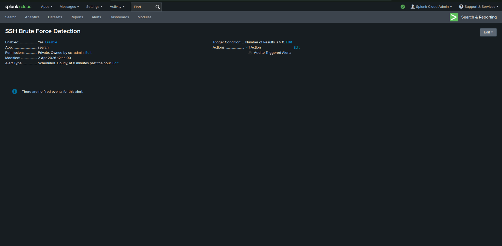
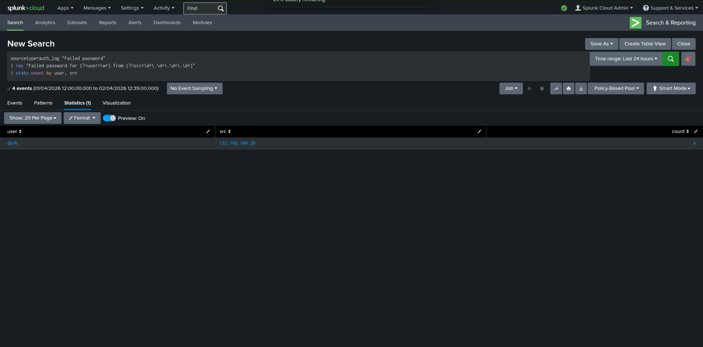
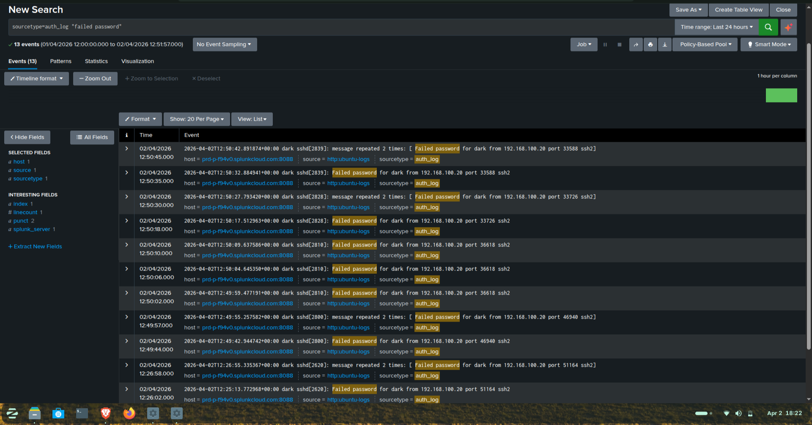

# 🔐 SSH Brute Force Detection using Splunk (SOC Lab)

## 📌 Project Overview

This project demonstrates detection of SSH brute force attacks using Splunk in a simulated SOC (Security Operations Center) environment.

The objective is to simulate an attack, ingest logs into Splunk, and build detection logic to identify malicious login attempts.

---

## 🧪 Lab Architecture

* **Attacker Machine:** Kali Linux
* **Target Machine:** Ubuntu Server
* **SIEM Platform:** Splunk Cloud
* **Log Source:** `/var/log/auth.log`
* **Log Ingestion Method:** HTTP Event Collector (HEC)

---

## ⚔️ Attack Simulation

* Performed SSH login attempts from Kali to Ubuntu server
* Generated multiple failed login attempts (brute force behavior)
* Logs were captured from the authentication log file

Brute force attacks involve repeated login attempts using different credentials to gain unauthorized access.

---

## 📥 Log Ingestion

Logs were forwarded to Splunk using HTTP Event Collector (HEC).

Verification query used:

```
index=*
```

This confirmed successful ingestion of logs into Splunk.

---

## 🔍 Detection Logic

The following Splunk query was used to detect brute force attempts:

```
sourcetype=auth_log "Failed password"
| rex "Failed password for (?<user>\w+) from (?<src>\d+\.\d+\.\d+\.\d+)"
| stats count by user, src
| sort - count
```

### 🧠 Explanation:

* Searches for failed SSH login attempts
* Extracts:

  * Username (`user`)
  * Source IP (`src`)
* Counts number of attempts per user and IP
* Identifies suspicious repeated login attempts

---

## 🚨 Alert Configuration

* **Trigger Condition:** Number of results > 0
* **Schedule:** Hourly
* **Action:** Add to Triggered Alerts

This enables real-time monitoring of brute force activity.

---

## 📊 Dashboard

A dashboard was created to visualize:

* Failed login attempts per IP
* Attack frequency over time
* User-based attack targeting

---

## 📸 Project Screenshots

### 🔹 Alert Configuration



### 🔹 Attack Simulation (Kali → Target)


### 🔹 Detection Query Output



### 🔹 Raw Logs (Failed Attempts)



### 🔹 Dashboard Visualization


---

## 🧠 Key Learnings

* Understanding SSH authentication logs
* Writing SPL (Splunk Processing Language) queries
* Detecting brute force attack patterns
* Log ingestion using HEC
* Building alerts and dashboards in Splunk

---

## 🚀 Future Improvements

* Implement threshold-based alerting (e.g., >5 attempts)
* Add geo-location enrichment for attacker IP
* Detect successful login after brute force attempts
* Integrate automated response (blocking IPs)

---

## 🏁 Conclusion

This project demonstrates how a SOC analyst can detect SSH brute force attacks using log analysis and SIEM tools like Splunk.

It simulates real-world attack scenarios and showcases detection, monitoring, and visualization techniques used in cybersecurity operations.

---
