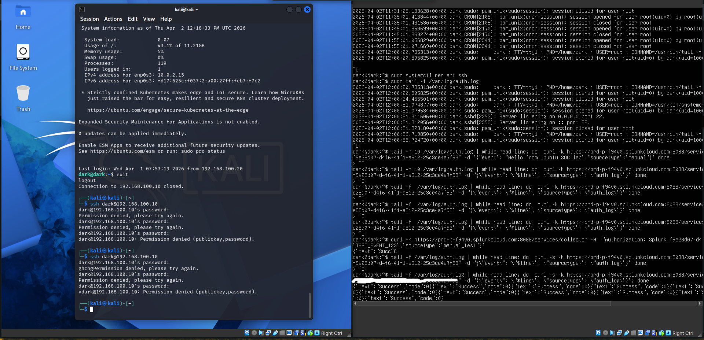
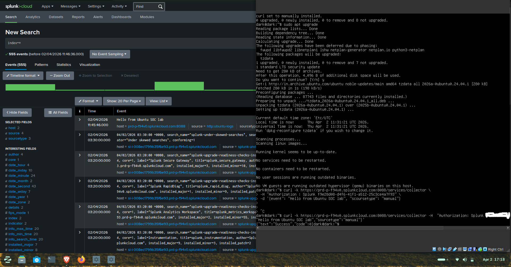
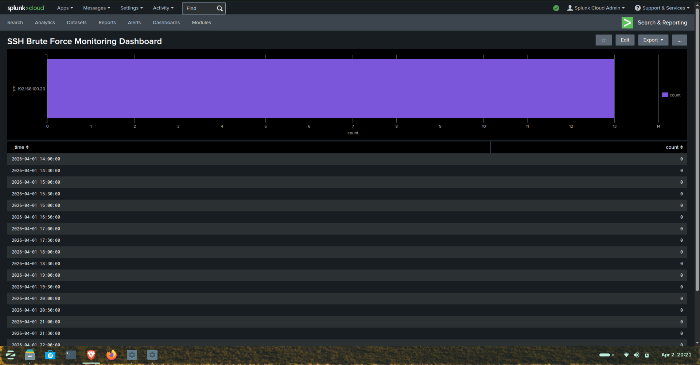

# 🔐 SSH Brute Force Detection using Splunk (SOC Lab)

## 📌 Project Overview

This project simulates an SSH brute force attack and demonstrates how to detect it using Splunk SIEM.

The goal is to replicate a real SOC (Security Operations Center) workflow:

* Simulate attack
* Ingest logs
* Detect malicious behavior
* Visualize and alert

---

## 🧪 Lab Setup

| Component  | Details                    |
| ---------- | -------------------------- |
| Attacker   | Kali Linux                 |
| Target     | Ubuntu Server              |
| SIEM       | Splunk Cloud               |
| Log Source | /var/log/auth.log          |
| Ingestion  | HTTP Event Collector (HEC) |

---

## ⚔️ Attack Simulation

* Multiple SSH login attempts were performed from Kali
* Incorrect passwords were used intentionally
* This generated repeated "Failed password" logs

👉 This behavior mimics a **brute force attack (MITRE ATT&CK T1110)**

---

## 📥 Log Ingestion

Logs were forwarded to Splunk using HEC.

Verification query:

```
index=*
```

✔ Confirms logs are successfully ingested

---

## 🔍 Detection Logic

### SPL Query:

```
sourcetype=auth_log "Failed password"
| rex "Failed password for (?<user>\w+) from (?<src>\d+\.\d+\.\d+\.\d+)"
| stats count by user, src
| where count >= 3
| sort - count
```

### 🧠 How it works:

* Filters failed SSH login attempts
* Extracts:

  * Username
  * Source IP
* Counts number of attempts per IP

---

## 🚨 Detection Outcome

Example result:
```
user = dark  
src = 192.168.100.20  
count = 4  
```
This indicates repeated failed login attempts from a single IP, which is a strong indicator of a brute force attack.

---

## 🧭 MITRE ATT&CK Mapping

Technique: T1110 – Brute Force  
Description: Adversaries attempt to gain access by trying multiple passwords.
---

## 🚨 Alert Configuration

* Trigger: Number of results > 0
* Schedule: Hourly
* Action: Add to Triggered Alerts

---

## 📊 Dashboard

Dashboard visualizes:

* Failed login attempts per IP
* Attack frequency over time
* Suspicious activity patterns

---

## 📸 Screenshots

### 🔹 Attack Simulation



### 🔹 Log Ingestion



### 🔹 Raw Logs


### 🔹 Detection Query


### 🔹 Dashboard



### 🔹 Alert


---

## 🧠 Key Learnings

* Understanding Linux authentication logs
* Writing SPL queries for threat detection
* Detecting brute force patterns
* Building alerts in Splunk
* Creating SOC dashboards

---

## 🚀 Future Improvements

* Add threshold-based detection (e.g., count > 5)
* Detect successful login after brute force
* Add Geo-IP enrichment
* Automate response (block IP)

---

## 🏁 Conclusion

This project demonstrates how brute force attacks can be detected using log analysis and SIEM tools like Splunk.

It replicates a real-world SOC use case and provides hands-on experience with attack detection and monitoring.

---
